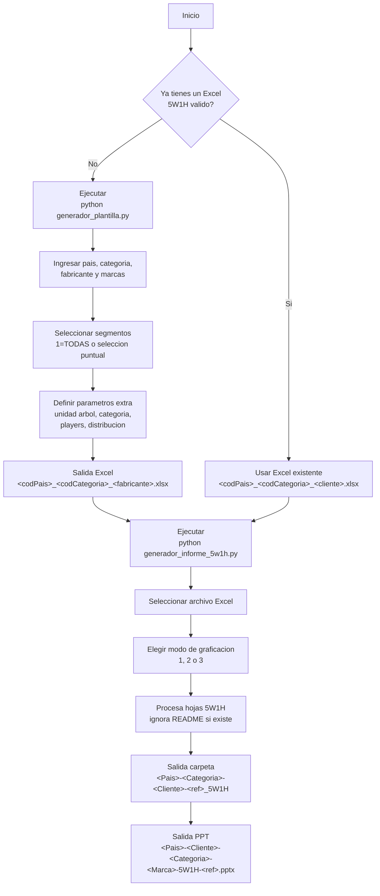

# 5W1H

Generador de reportes 5W1H desde Excel a PowerPoint, con utilitario para crear plantillas de entrada.

## Que incluye
- `generador_informe_5w1h.py`: procesa un `.xlsx` 5W1H y genera el `.pptx`.
- `generador_plantilla.py`: crea un `.xlsx` base desde `Plantilla_Entrada_5W1H.xlsx` con hojas dinamicas.
- `Plantilla_Entrada_5W1H.xlsx`: plantilla de entrada.
- `Modelo_5W1H.pptx`: plantilla de salida para el informe.
- `Instrucciones de llenado.txt`: guia de llenado del Excel.

## Requisitos
- Python 3.10+
- `pandas`
- `numpy`
- `matplotlib`
- `python-pptx`
- `openpyxl`
- `rich` (usado por `generador_plantilla.py`)

Instalacion:

```bash
pip install pandas numpy matplotlib python-pptx openpyxl rich
```

## Inicio rapido

### 1) Generar un archivo de entrada (recomendado)

```bash
python generador_plantilla.py
```

Flujo del script:
1. Pais.
2. Categoria.
3. Fabricante (se usa para nombre de archivo).
4. Marcas (una por linea, todas quedan en el mismo archivo).
5. Segmentos a incluir (`1=TODAS` o seleccion puntual).
6. Si aplica, parametros extra:
   - unidad del arbol de medidas (segmento 2),
   - etiqueta de categoria,
   - etiqueta objetivo de Players,
   - corte de distribucion.

Salida:
- `<codPais>_<codCategoria>_<fabricante>.xlsx`

### 2) Generar el informe

```bash
python generador_informe_5w1h.py
```

Flujo del script:
1. Lista archivos `.xlsx` disponibles y permite elegir uno.
2. Pide modo de graficacion:
   - `1`: compras y ventas juntas.
   - `2`: compras y ventas separadas.
   - `3`: sin ventas.
3. Genera slides y guarda el `.pptx`.

## Flujo general (Mermaid)



## Formato del Excel de entrada

### Nombre de archivo
- Estructura: `<codPais>_<codCategoria>_<cliente>.xlsx`
- Ejemplo: `52_CARB_CocaCola.xlsx`
- `codPais` y `codCategoria` deben existir en los diccionarios internos del script.

### Hojas esperadas
- Segmentos de marca:
  - `1_*`
  - `2_*`
  - `3_*`
  - `4_*`
  - `5_*`
- Segmentos de categoria:
  - `6_*`
  - `6-1_*` o `6_1_*`
  - `7_*_*` (ej. `R`, `NSE`, `CANAL`, etc.)
  - `8_*`

Notas:
- Si existe hoja `README`, el informe la ignora automaticamente.
- Si solo hay `README` y no hay hojas analiticas, el script falla con error claro.

## Parametros extra (generador_plantilla.py)

### Unidad del arbol de medidas (Segmento 2)
Se solicita cuando seleccionas la plantilla de segmento 2.

Opciones admitidas:
- Por numero: `1..7`
- Por letra: `U`, `L`, `K`, `T`, `R`, `M`, `H`

Mapa:
- `1= U -> Units`
- `2= L -> Litros`
- `3= K -> Kilos` (default)
- `4= T -> Toneladas`
- `5= R -> Rollos`
- `6= M -> Metros`
- `7= H -> Hojas`

### Etiqueta de categoria
Reemplaza `Categoria`/`CategoriaEjemplo` en hojas y contenido.

### Etiqueta objetivo de Players
Reemplaza `XX` en la hoja `6_Categoria_XX`.
Ejemplo de uso: `Fabricante`, `Marca Propia`, `Top 5`, etc.

### Corte de distribucion
Reemplaza el sufijo de la hoja `7_*_*`.
Ejemplos: `Canal`, `NSE`, `R`, `WIFEAGE`.

## Salidas generadas

### Excel (plantilla)
- Archivo unico con todas las marcas solicitadas.
- Conserva hoja `README` si existe.
- Orden de hojas:
  - `README`
  - segmentos `6/7/8`
  - luego segmentos de marca (`1/2/3/4/5`) por cada marca.
- Agrega al final de `README` un bloque con parametros seleccionados.

### PowerPoint (informe)
- Crea carpeta por archivo:
  - `<Pais>-<Categoria>-<Cliente>-<ref>_5W1H`
- Dentro guarda el `.pptx`:
  - `<Pais>-<Cliente>-<Categoria>-<Marca>-5W1H-<ref>.pptx`

`<ref>` se calcula desde la fecha de corte detectada en los datos.

## Diagnostico rapido
- Error de pais/categoria: revisar nombre del `.xlsx`.
- Error de lectura de fechas: usar formato tipo `mmm-yy`.
- Error por template faltante: validar que `Modelo_5W1H.pptx` y `Plantilla_Entrada_5W1H.xlsx` esten en la misma carpeta del script.
- Si hay varios `.xlsx`, verifica seleccionar el archivo correcto en la lista.
